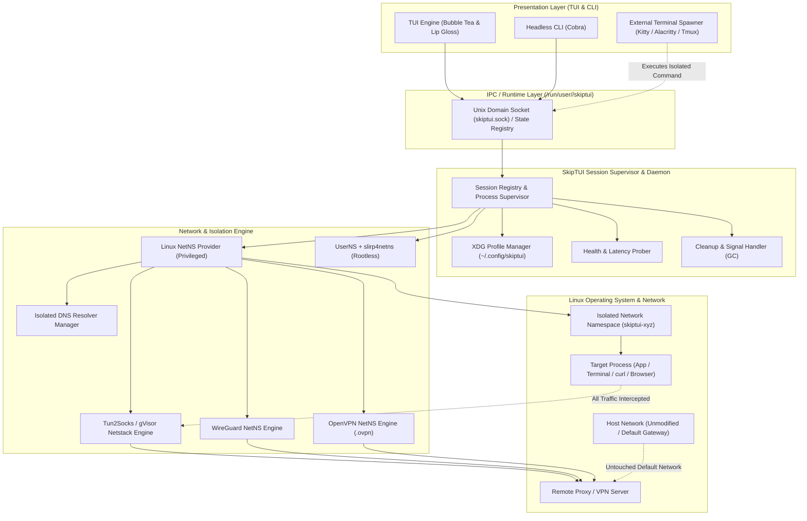

# SkipTUI: Architecture & System Design

## 1. System Architecture Overview

SkipTUI adopts a client/daemon modular architecture. The **TUI Presentation Layer** and **Headless CLI** interact with a **Local Session Supervisor & Daemon** over a Unix Domain Socket (`/run/user/<UID>/skiptui/skiptui.sock`), allowing isolated sessions to persist independently of the TUI process.



---

## 2. Core Components Breakdown

### 2.1 Presentation Layer (`internal/tui`, `cmd/`, `internal/terminal`)
- **Bubble Tea App Loop**: Reactive UI for managing profiles, monitoring live sessions, and testing connection latency.
- **External Terminal Spawner (`internal/terminal`)**:
  - Automatically discovers user's installed terminal emulator (checking `$TERMINAL`, `kitty`, `alacritty`, `wezterm`, `ghostty`, `foot`, `gnome-terminal`, `tmux`).
  - Launches isolated shells in a new window or tmux split, allowing the user to work in their terminal while keeping the SkipTUI dashboard visible.
- **Headless CLI Parity (`cmd/`)**:
  - Full CLI command set (`skiptui run`, `skiptui list`, `skiptui kill`, `skiptui import`, `skiptui test`).

### 2.2 Profile & Configuration Store (`internal/config` & `internal/profile`)
- Follows the **XDG Base Directory Specification**:
  - Global Settings: `~/.config/skiptui/config.yaml`
  - Profiles Directory: `~/.config/skiptui/profiles/`
  - Runtime Socket & State: `/run/user/<UID>/skiptui/`
- Protocol Schemas:
  - **SOCKS5 / SOCKS5h**: Host, port, username, password, remote DNS.
  - **WireGuard**: Private key, endpoint, address, allowed IPs, DNS.
  - **OpenVPN**: Native `.ovpn` configuration parser (inline certificates, keys, auth-user-pass).
  - **HTTP/HTTPS**: Host, port, basic auth.
  - **Shadowsocks**: Server, port, cipher, password.

### 2.3 Isolation Engine (`internal/isolation`)
- **`NetnsEngine` (Privileged Mode - Default)**:
  - Uses `github.com/vishvananda/netlink` to create `netns`, bring up `lo`, attach TUN devices or migrate WireGuard/OpenVPN interfaces.
  - Injects isolated `/etc/resolv.conf` and blocks host D-Bus systemd-resolved leaks.
- **`RootlessEngine` (Non-Root Fallback)**:
  - Uses `unshare(CLONE_NEWUSER | CLONE_NEWNET)` with `slirp4netns` or embedded gVisor user-space TCP/IP stack.

### 2.4 Tunneling Backends (`internal/tunnel`)
1. **Tun2Socks Adapter**: Layer-3 IP packet to Layer-5 SOCKS5/HTTP translation in pure Go.
2. **WireGuard NetNS Adapter**: Kernel WireGuard link created on host and moved into target netns.
3. **OpenVPN NetNS Adapter**: Spawns isolated OpenVPN client inside the target namespace with dedicated tun interface.

### 2.5 Persistent Session Supervisor & Daemon (`internal/session`)
- Manages sandbox lifecycles independently of the TUI frontend.
- When SkipTUI is closed, background sessions remain active unless explicitly killed.
- Reopening SkipTUI immediately reconnects to active sessions via the local socket.

---

## 3. End-to-End Execution Flow (External Terminal Launch)

```mermaid
sequenceDiagram
    autonumber
    actor User as User
    participant TUI as SkipTUI Dashboard
    participant Daemon as Session Daemon
    participant Iso as Isolation Engine
    participant Term as External Terminal (e.g. Kitty/Alacritty)
    participant Proc as Isolated Shell (zsh/bash)

    User->>TUI: Press [l] -> Select Profile ("NL-WireGuard") + Command ("zsh")
    TUI->>Daemon: Request Spawn Session (profile="NL-WireGuard", cmd="zsh")
    Daemon->>Iso: Provision Network Namespace + WireGuard Link
    Daemon->>Term: Spawn Terminal Window: "skiptui exec <session-id>"
    Term->>Proc: Run "zsh" inside "skiptui-sandbox-1234"
    Proc-->>Daemon: Process Alive (PID: 58210)
    Daemon-->>TUI: Session Running (Update Live Sessions Table)
    Note over User,Proc: User interacts in Terminal window; TUI displays live RX/TX speed
    User->>TUI: Exit SkipTUI Dashboard [q]
    TUI->>User: Prompt: "Detach sessions [d] or Terminate all [k]?"
    User->>TUI: Select Detach [d]
    TUI->>TUI: Close Dashboard (Daemon & Isolated Terminal remain running)
```

---

## 4. Key Architectural Principles

1. **Host Invariance**: Zero alterations to host-level default routing, LAN connectivity, or host `/etc/resolv.conf`.
2. **Persistent Independence**: Frontends (TUI, CLI, scripts) are decoupled from running isolated workloads via a local supervisor.
3. **Multi-Protocol Completeness**: First-class support for SOCKS5, WireGuard, OpenVPN (`.ovpn`), HTTP, and Shadowsocks.
4. **Leak-Proof Fail-Closed Design**: Hardware kill-switch behavior; if the tunnel drops, packets are immediately discarded.
