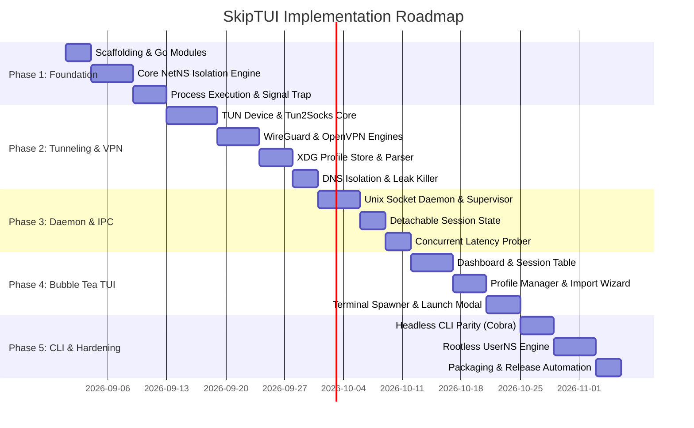

# SkipTUI: Implementation Roadmap & Milestones

## 1. Roadmap Overview

---

## 2. Milestone Breakdown & Deliverables

### Phase 1: Core Foundation & Linux Namespace Engine
- [ ] Initialize Go repository, `go.mod`, directory layout, and CI linters.
- [ ] Implement `internal/isolation/netns`:
  - Create isolated network namespace (`ip netns add ...` via netlink).
  - Bring up `lo` interface.
  - Spawn target process inside namespace (`unix.Setns`).
  - Cleanup namespace on process exit.
- [ ] Implement robust Signal Handler (`SIGINT`, `SIGTERM`, `SIGHUP`) and stale namespace sweeper.
- **Acceptance Criteria**: Running a test binary spawns a process with an isolated `lo` interface and no access to host `eth0` / WAN.

### Phase 2: Tunneling Engines (Tun2Socks, WireGuard, OpenVPN)
- [ ] Integrate embedded `tun2socks` engine:
  - Allocate TUN interface `tun0` inside namespace.
  - Connect TUN raw packets to upstream SOCKS5 / HTTP proxy.
- [ ] Implement WireGuard netns migration adapter (`wgctrl`).
- [ ] Implement OpenVPN parser (`internal/config/ovpn_parser.go`) and isolated OpenVPN worker.
- [ ] Implement isolated DNS resolver (`resolv.conf` binding & D-Bus blocking).
- **Acceptance Criteria**: Running `curl ifconfig.me` inside SOCKS5, WireGuard, or OpenVPN sandbox returns the proxy/VPN IP while host IP remains unchanged.

### Phase 3: Daemon, IPC & Session Persistence
- [ ] Implement Unix Domain Socket Server (`/run/user/<UID>/skiptui/skiptui.sock`).
- [ ] Build Session Supervisor to track running sandboxes, PIDs, and RX/TX traffic.
- [ ] Implement session persistence across frontend disconnects.
- [ ] Implement concurrent latency prober (`internal/netprobe`).
- **Acceptance Criteria**: Closing the CLI or frontend leaves sandboxed workloads running; reconnecting restores live session state.

### Phase 4: Bubble Tea TUI & External Terminal Spawner
- [ ] Implement `internal/tui/app.go` (Main Elm architecture loop).
- [ ] Build **Sessions View**: live table of active sandboxes, PIDs, RX/TX traffic, and status badges.
- [ ] Build **Profiles View**: list profiles, run live latency tests, and view details.
- [ ] Build **Import Wizard**: file picker modal for `.ovpn` and `.conf` files.
- [ ] Implement **External Terminal Spawner** (`internal/terminal/spawner.go`): detects `$TERMINAL`, `kitty`, `alacritty`, `wezterm`, or `tmux` and spawns isolated shell sessions in separate windows.
- [ ] Implement **Exit Confirmation Dialog**: prompt to Detach vs Terminate All.
- **Acceptance Criteria**: User can browse profiles, test latency, launch terminal shells in external windows, and monitor bandwidth in real-time.

### Phase 5: CLI Parity, Rootless Mode & Packaging
- [ ] Implement full Cobra CLI subcommands:
  - `skiptui run --profile <name> [--terminal] -- <command>`
  - `skiptui list`, `skiptui kill <id>`, `skiptui import <file>`, `skiptui test`
- [ ] Implement `internal/isolation/rootless` via User Namespaces (`CLONE_NEWUSER`) + `slirp4netns` or gVisor netstack.
- [ ] Configure `GoReleaser` for building binaries, `.deb`, `.rpm`, and Arch Linux PKGBUILDs.
- **Acceptance Criteria**: Complete CLI and TUI feature parity with 100% test coverage for core namespace operations.
